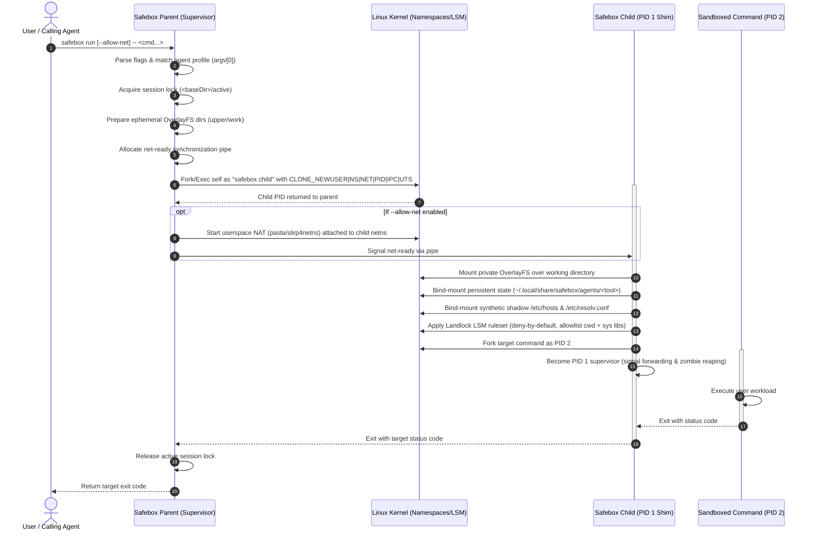

# Safebox Architecture & Systems Internals

This document is the authoritative technical reference for the architecture, process lifecycle, kernel primitives, package structure, and security guarantees of Safebox.

---

## 1. System Overview & Defense-in-Depth

Safebox provides unprivileged, microsecond-latency containment for untrusted CLI tools and autonomous AI coding agents. It enforces security through a five-layer defense-in-depth model implemented entirely in user space without requiring root privileges or setuid binaries:

```
+-------------------------------------------------------------------------+
| Layer 5: PID 1 Supervisor Shim (reaps zombies, forwards signals)        |
+-------------------------------------------------------------------------+
| Layer 4: Landlock LSM Containment (deny-by-default kernel FS controls)  |
+-------------------------------------------------------------------------+
| Layer 3: Ephemeral OverlayFS & State Mounts (shadows host FS mutations) |
+-------------------------------------------------------------------------+
| Layer 2: Userspace NAT (CLONE_NEWNET + pasta / slirp4netns forwarder)   |
+-------------------------------------------------------------------------+
| Layer 1: Linux Namespaces (CLONE_NEWUSER, NEWNS, NEWPID, NEWIPC, UTS)   |
+-------------------------------------------------------------------------+
```

---

## 2. Process Lifecycle & Execution Flow

When `safebox run -- <command...>` is invoked, the execution spans two discrete process stages: the **Parent Supervisor** and the **Child Sandbox Container**.



---

## 3. Kernel Isolation Primitives

### 3.1 Linux Namespaces
- **`CLONE_NEWUSER`**: Maps the host UID/GID to root (`uid=0, gid=0`) inside the namespace via `/proc/self/uid_map` and `/proc/self/gid_map`. Enables unprivileged mounting without root privileges.
- **`CLONE_NEWNS`**: Detaches mount points from the host namespace, ensuring all mount operations (OverlayFS, shadow `/etc`, persistent state) remain completely invisible to the host.
- **`CLONE_NEWNET`**: Creates an empty network stack with only an unconfigured loopback interface. Outbound traffic is physically impossible unless `--allow-net` bridges the namespace via userspace NAT.
- **`CLONE_NEWPID`**: Isolates process hierarchy. The child entrypoint becomes PID 1 inside the sandbox, isolating the host process table.
- **`CLONE_NEWIPC` & `CLONE_NEWUTS`**: Isolates shared memory, message queues, and system hostname.

### 3.2 Ephemeral OverlayFS & Change Tracking
- Sandboxed writes are trapped in an ephemeral upper directory (`upperdir`) combined with an isolated working directory (`workdir`) mounted over the target directory (`lowerdir`).
- Destructive operations, file deletions (whiteout character devices), and new files are staged in the upper layer without modifying the host working tree.
- `safebox diff` reads the upper directory directly to display colored status.
- `safebox apply` stages additions and modifications into a temporary directory before committing changes atomically to the host.
- `safebox revert` purges the upper and work layers, restoring the pristine baseline.

### 3.3 Landlock LSM File System Lockdown
- Restricts filesystem access at the kernel level via the Linux Landlock Linux Security Module (ABI v1+).
- **Default Policy**: Deny-by-default.
- **Read-Write Grants**: The sandboxed working directory (`cwd`) and explicit `--allow-path-rw` arguments.
- **Read-Only Grants**: System runtimes (`/usr`, `/usr/local`, `/lib`, `/lib64`, `/etc/ld.so.conf.d`) and safe configuration files (`/etc/passwd`, `/etc/group`, `/etc/localtime`, `/etc/ld.so.cache`, `/etc/ld.so.conf`, `/etc/nsswitch.conf`).
- **Forbidden Invariants**: The default ruleset strictly forbids access to `$HOME` (`~/.ssh`, `~/.aws`, `~/.gnupg`) and `/etc/shadow`.
- **Zero BestEffort Rule**: Landlock setup must fail loud. The codebase strictly avoids `.BestEffort()`, treating Landlock activation failures as fatal security errors.

### 3.4 Host File Invariant Protection
- To prevent DNS poisoning or host network corruption, Safebox never writes to the host `/etc/resolv.conf` or `/etc/hosts`.
- Instead, Safebox creates synthetic temporary files in `/tmp`, bind-mounts them inside the child mount namespace, and immediately unlinks the temporary files from the host filesystem.

### 3.5 Userspace Networking & NAT Subsystem
Safebox provides controlled outbound internet connectivity via userspace Network Address Translation (NAT) without exposing host network interfaces or requiring root network privileges (`CAP_NET_ADMIN`):
- **Backend Selection Hierarchy**: When `--allow-net` is specified, Safebox probes backends in priority order: `pasta` -> `slirp4netns` -> `builtin` (pure-Go Layer 2 TAP forwarder). On Linux distributions where `pasta` is not installed, Safebox automatically selects `slirp4netns`.
- **Namespace Attachment Protocol**: The parent supervisor spawns the child in an empty network namespace (`CLONE_NEWNET`) and creates a synchronization pipe (`--ready-fd`). The parent attaches the forwarder to the child PID:
  ```bash
  slirp4netns -c --mtu 1500 --disable-host-loopback --ready-fd=3 <childPID> tap0
  ```
- **Interface Configuration (`-c`)**: The `-c` (`--configure`) option automatically brings up the `tap0` interface inside the container, assigns IP address `10.0.2.100`, and sets default gateway `10.0.2.2`.
- **Virtual DNS Proxy (`10.0.2.3`)**: In `slirp4netns`, `10.0.2.3` is an internal virtual IP simulated in user space that acts as a local DNS proxy. Inside the child, a synthetic `/etc/resolv.conf` with `nameserver 10.0.2.3` is bind-mounted. DNS queries on port 53 are intercepted and forwarded to the host DNS servers outside the container.
- **Host Loopback Protection**: Safebox passes `--disable-host-loopback`, strictly forbidding the container from connecting to `127.0.0.1` on the host, preventing access to host databases, redis instances, or internal services.
- **TLS Root CA Certificate Access**: Landlock default read allowlists include `/etc/ssl` and `/etc/pki`, allowing HTTPS clients (`curl`, `git`, `agy`, Python) to verify TLS certificates against host root CAs without manual path flags.

---

## 4. Modular Package Map

The `safebox` codebase is structured into eight modular Go packages with strict separation of concerns:

| Package | Directory | Core Architectural Responsibility |
| :--- | :--- | :--- |
| `main` | `agent-safebox/` | CLI bootstrap, argument validation, and routing to dispatch. |
| `internal/cli` | `agent-safebox/internal/cli/` | Subcommand handlers (`run`, `child`, `diff`, `apply`, `revert`, `probe`, `profile`), argument parser, and user hints. |
| `internal/isolation` | `agent-safebox/internal/isolation/` | Kernel namespace creation, Landlock LSM rule compilation, OverlayFS mounting, and PID 1 init supervisor shim. |
| `internal/netpolicy` | `agent-safebox/internal/netpolicy/` | Userspace NAT orchestration (`pasta`, `slirp4netns`, pure-Go TAP), DNS pinning, and network namespace readiness synchronization. |
| `internal/persistentstate` | `agent-safebox/internal/persistentstate/` | Per-tool state directory preparation under `$XDG_STATE_HOME`, strict `0700` permission enforcement, and in-namespace bind mounting. |
| `internal/profiles` | `agent-safebox/internal/profiles/` | Declarative agent profile schemas, 16 embedded TOML configurations, custom user profile loader, and hand-rolled TOML parser. |
| `internal/revert` | `agent-safebox/internal/revert/` | Session lifecycle management, active PID lockfile coordination, diff generation, atomic staging commit, and whiteout cleanup. |
| `internal/trace` | `agent-safebox/internal/trace/` | Nanosecond-accurate execution step timing and formatted `stderr` badges (`[safebox]`, `[safebox:child]`). |
| `internal/ui` | `agent-safebox/internal/ui/` | Lipgloss terminal formatting, status badges, and color tokens. |

---

## 5. Complete File-by-File Inventory

### Root & Entrypoint
- `COMMANDS.md`: Exhaustive CLI command reference documenting all subcommands, flags, and verified outputs.
- `install.sh`: Standalone, zero-dependency POSIX installation script with architecture detection and atomic unpack.
- `main.go`: Thin entrypoint (<25 lines) verifying minimum arguments and delegating to `cli.Dispatch`.
- `main_test.go`: Unit tests for main entrypoint argument checking, versioning, and exit codes.
- `race_enabled_test.go`: Build-tag guarded helper for race detector test configurations.
- `race_disabled_test.go`: Build-tag guarded helper for non-race test configurations.

### `internal/cli` (Subcommand Dispatch & Parsers)
- `dispatch.go`: Central command router mapping subcommands to their respective runners.
- `parser.go`: Command-line flag tokenizer, validating mandatory `--` delimiters and options.
- `parser_test.go`: Unit test suite for flag tokenization and validation edge cases.
- `run.go`: Parent supervisor runner setting up namespaces, NAT, sessions, and child processes.
- `child.go`: Containerized child entrypoint executing mounts, Landlock restrictions, and PID 1 shim.
- `diff.go`: Change inspection runner formatting status markers (`+`, `~`, `-`) and unified diffs.
- `cat.go`: Staged file content streaming runner reading from active session upper layer or host.
- `cat_test.go`: Unit tests for file inspection, flag handling, and directory traversal.
- `version.go`: Version metadata, Git commit extraction via runtime/debug, and version output formatter.
- `version_test.go`: Unit tests for version string format, OS/arch detection, and exit codes.
- `apply.go`: Atomic staging runner promoting OverlayFS upper modifications to the host.
- `revert.go`: Session discard runner purging OverlayFS layers and restoring baseline.
- `probe.go`: Pre-flight inspection runner displaying effective allowlists without execution.
- `profile.go`: Profile management runner listing and showing agent TOML configurations.
- `help.go`: Usage documentation and help text generator.
- `hint.go`: Actionable remediation engine suggesting flags on permission denial.
- `cli_test.go`: Integration tests for CLI subcommands, exit codes, and error formatting.
- `integration_e2e_test.go`: End-to-end network egress and host isolation tests.

### `internal/isolation` (Kernel Primitives & LSM)
- `namespace.go`: Syscall wrapper creating user, mount, net, PID, IPC, and UTS namespaces.
- `namespace_test.go`: Tests validating UID/GID mapping and unprivileged namespace creation.
- `landlock.go`: Deny-by-default Landlock LSM ruleset compiler and activator.
- `landlock_test.go`: Tests asserting path restriction, system lib allowlists, and error handling.
- `overlay.go`: Unprivileged OverlayFS mounter combining lower, upper, and work layers.
- `overlay_test.go`: Tests verifying OverlayFS mount options and permission preservation.
- `shim.go`: Minimal PID 1 supervisor handling signal forwarding and zombie child reaping.
- `shim_test.go`: Tests verifying signal propagation and child process reaping.
- `errors.go`: Structured domain error types and human-readable formatting.
- `errors_test.go`: Unit tests for structured error formatting and unwrapping.

### `internal/netpolicy` (Userspace Networking & NAT)
- `netpolicy.go`: NAT coordinator selecting best available userspace packet forwarder.
- `netpolicy_test.go`: Unit tests for backend discovery and command generation.
- `dns.go`: Thread-safe DNS resolver and IP pinning engine (`PinnedIPSet`).
- `builtin.go`: Pure-Go userspace Layer 2 TAP packet forwarder for fallback environments.

### `internal/persistentstate` (Agent State Isolation)
- `state.go`: State directory resolver, strict `0700` permission creator, and mount applicator.
- `state_test.go`: Unit tests for XDG state path resolution and mount error scenarios.

### `internal/profiles` (Agent Profile System)
- `profile.go`: Data structs and schemas defining agent filesystem and network access policies.
- `profile_test.go`: Tests for profile validation, inheritance, and matching logic.
- `registry.go`: Embedded profile registry providing access to all 16 built-in configurations.
- `load.go`: User profile loader reading custom overrides from `~/.config/safebox/profiles/`.
- `toml.go`: Zero-dependency, hand-rolled TOML parser tailored for agent profile schemas.

### `internal/revert` (OverlayFS Session Management)
- `session.go`: Session lifecycle manager tracking active PID locks, metadata, and pruning.
- `session_test.go`: Tests for lockfile acquisition, collision prevention, and stale PID recovery.
- `diff.go`: Filesystem comparator walking lower and upper layers to compute change sets.
- `diff_test.go`: Tests verifying change detection for additions, modifications, and deletions.
- `patch.go`: Pure-Go unified diff engine computing LCS line-by-line diffs and git-style hunks.
- `patch_test.go`: Tests asserting unified patch generation for added, modified, deleted, and binary files.
- `filter.go`: Path filter evaluator restricting diffs to specified directory subtrees.
- `shadow_apply.go`: Atomic staging applier handling cross-filesystem copies and whiteouts.
- `shadow_apply_test.go`: Tests verifying atomic commit and directory whiteout cleanup.
- `shadow.go`: Helper functions resolving active session directories and state files.
- `shadow_test.go`: Tests for session path resolution and directory helpers.
- `git.go`: Git working tree restore fallback for non-OverlayFS workspaces.
- `git_test.go`: Tests for git checkout and clean fallback mechanisms.
- `revert.go`: High-level session discard coordinator.
- `revert_test.go`: Tests asserting clean session teardown and error handling.

### `internal/trace` & `internal/ui` (Observability & Terminal UI)
- `trace.go`: Execution step timer emitting structured stderr badges (`[safebox]`).
- `trace_test.go`: Tests for step timing accuracy and output formatting.
- `styles.go`: Lipgloss styling definitions, color tokens, and visual badges.
- `styles_test.go`: Tests verifying terminal escape sequence generation.

### Release & CI/CD Tooling
- `.github/workflows/release.yml`: GitHub Actions automated release pipeline cross-compiling Linux binaries and publishing release assets.
- `scripts/manual-release.sh`: Offline/local cross-compilation helper generating Linux amd64/arm64 release archives and checksums.


---

## 6. Concrete Execution Deep-Dive: Running an Autonomous Coding Agent

To understand how these isolation primitives cooperate during real-world usage, consider what happens when a developer launches an autonomous coding agent such as `agy` (Antigravity CLI) inside Safebox:

```bash
safebox run --allow-net --allow-path=/root/.local/bin -- agy
```

### 6.1 Step 1: Profile Resolution & Session Setup (Parent Process)
1. **Profile Lookup**: Safebox inspects `argv[0]` (`agy`), matches the built-in profile `internal/profiles/builtin/agy.toml`, and extracts:
   - Persistent state mount: `$HOME/.gemini`
   - Persistent state storage directory: `$XDG_STATE_HOME/safebox/agents/agy`
   - Network egress toggle: `allow_net = true`
2. **Session Allocation**: Safebox creates an ephemeral session directory under `$SAFEBOX_SESSION_ROOT` (assume the directory is `/tmp/safebox/sessions/sess-demo-12345/`).
   - `sess-demo-12345/active`: Holds the child PID lock to prevent accidental concurrent deletion.
   - `sess-demo-12345/upper`: Dedicated OverlayFS delta layer capturing all working directory writes.
   - `sess-demo-12345/work`: Dedicated OverlayFS scratchpad directory for atomic rename operations.
   - `sess-demo-12345/merged`: Empty mountpoint directory on the host where OverlayFS will be attached inside the container.
   - `sess-demo-12345/session.json`: Session metadata recording lower directory, upper directory, and timestamp.
   - `sess-demo-12345/netconfig.json`: Network configuration specifying userspace NAT parameters (gateway `10.0.2.2`, DNS `10.0.2.3`).

### 6.2 Step 2: Namespace Creation & Child Spawn
Safebox spawns the child process via `clone` with six unprivileged Linux namespace flags:
- `CLONE_NEWUSER`: Maps host UID/GID to container root UID 0 without host root privileges.
- `CLONE_NEWNS`: Creates a completely independent, private mount table for the container.
- `CLONE_NEWPID`: Places the child process into a fresh PID hierarchy where the child is PID 1.
- `CLONE_NEWNET`: Disconnects host networking interfaces, leaving only loopback.
- `CLONE_NEWIPC`: Isolates POSIX message queues and shared memory.
- `CLONE_NEWUTS`: Isolates hostname configuration.

### 6.3 Step 3: Container Filesystem Assembly (Child Execution Sequence)
Inside the child process, before any agent code executes:
1. **Userspace NAT & Egress**: The parent attaches `slirp4netns` to the child network namespace with `-c` and `--disable-host-loopback`. Inside the child, `applyEgressConfig` bind-mounts a synthetic `/etc/resolv.conf` (pointing to virtual DNS proxy `10.0.2.3`) and `/etc/hosts`.
2. **Fresh Procfs Mount**: `isolation.MountProc()` mounts a fresh `procfs` over `/proc`. This ensures `/proc/self` maps accurately to container PID 1 rather than host PID 1 (`systemd`), preventing crashes in runtimes (such as Bun, WebKit, and Node) that assert on `/proc/self` state.
3. **OverlayFS Mount**: Safebox mounts `overlay` over `merged/` combining:
   - Lower layer: Assume host working directory `/root/demo-project/` (or the repository workspace at `/workspace/agent-safebox/` when developing on Safebox itself) (read-only).
   - Upper layer: `/tmp/safebox/sessions/sess-demo-12345/upper` (read-write).
   - Work layer: `/tmp/safebox/sessions/sess-demo-12345/work`.
4. **Working Directory Shift**: The child changes directory (`os.Chdir`) into `merged/`.
5. **Persistent State Bind-Mount**: Safebox bind-mounts the persistent host directory `/root/.local/share/safebox/agents/agy` directly onto `/root/.gemini` inside the container.
6. **Landlock LSM Lockdown**: `isolation.ApplyLandlock()` activates kernel filesystem access control:
   - **Read-Write**: `merged/` (working directory) and `/root/.gemini` (persistent state).
   - **Read-Only**: System libraries (`/usr`, `/lib`, `/lib64`), root certificates (`/etc/ssl`, `/etc/pki`), character devices (`/dev/urandom`, `/dev/random`), and explicitly allowed binaries (`--allow-path=/root/.local/bin`).
   - **Read-Write Character Devices**: `/dev/null` and `/dev/zero`.
   - **Strict Deny**: The remainder of `/root` (including `/root/.ssh`, `/root/.bashrc`, and `/root/other-projects`) returns `EACCES`.
7. **Exec Handoff**: The child hands execution over to `agy`.

### 6.4 Step 4: Live File Routing & Change Tracking
Assume the agent is asked to create a system design plan and then implement a server:

1. **Agent Writes an Artifact (`/plan`)**:
   - The agent writes to its internal brain directory: Assume `~/.gemini/antigravity-cli/brain/demo-uuid-456/system_design_plan.md`.
   - **Routing**: Because `~/.gemini` was bind-mounted to `$XDG_STATE_HOME/safebox/agents/agy`, this file is physically written to:
     ```
     /root/.local/share/safebox/agents/agy/antigravity-cli/brain/demo-uuid-456/system_design_plan.md
     ```
   - **Host Protection**: The host real `/root/.gemini` directory is completely untouched.
   - **Working Directory Status**: Because this write occurred under `~/.gemini` rather than the working directory, the session `upper/` directory remains clean.

2. **Agent Writes Code Files (`write_to_file`)**:
   - Assume the agent now creates `server.go` in the project directory.
   - **Routing**: Because the working directory is an OverlayFS merged view, the Linux kernel diverts the write into the upper layer:
     ```
     /tmp/safebox/sessions/sess-demo-12345/upper/server.go
     ```
   - **Host Protection**: The host directory `/root/demo-project/` still does NOT have `server.go`.
   - **Host Inspection**: From another terminal on the host, the developer runs:
     ```bash
     safebox diff
     # Output: + [ADDED] server.go
     ```
   - **Commit or Discard**:
     - `safebox apply --yes`: Atomically copies `server.go` from `upper/` to `/root/demo-project/`.
     - `safebox revert --yes`: Discards the session and wipes `upper/`, leaving the host workspace pristine.

---

## 7. Architectural FAQ

### Q1: Where is the OverlayFS present, and why does `/tmp/safebox/sessions/.../merged` appear empty when inspected from a host terminal?
In Linux, mounts created inside a process that has called `clone` with `CLONE_NEWNS` (private mount namespace) are attached exclusively to that process mount table.
- From the host namespace, `/tmp/safebox/sessions/.../merged` is simply an empty directory acting as an inactive mountpoint.
- Inside the sandboxed container namespace, the kernel OverlayFS driver is actively mounted on `merged/`, presenting a unified view of the host project files plus any session writes.
- To inspect changes from the host, use `safebox diff` or inspect `/tmp/safebox/sessions/.../upper/` directly.

### Q2: Where do AI coding agents store artifacts and login tokens, and why is the host real `~/.gemini` or `~/.claude` untouched?
Autonomous agents frequently persist authentication tokens, conversation histories, and plan artifacts in configuration folders under `$HOME` (e.g., `~/.gemini`, `~/.claude`, `~/.config/aider`).
- Safebox defines persistent state mappings in `internal/profiles/builtin/<agent>.toml`.
- Before Landlock lockdown, Safebox bind-mounts `$XDG_STATE_HOME/safebox/agents/<agent>/` over the tool configuration directory inside the child mount namespace.
- All session writes to `~/.gemini` are transparently directed into the isolated persistent state directory on the host. The host real `~/.gemini` is never exposed or modified.

### Q3: Why is the session `upper/` directory empty during an agent planning or conversation phase?
The OverlayFS `upper/` directory records modifications strictly to the working directory (`cwd`).
- When an agent runs `/plan` or discusses requirements, its artifacts and conversation transcripts are stored within its persistent state directory (e.g., `~/.gemini/antigravity-cli/brain/`).
- Until the agent executes a tool that creates, modifies, or deletes a file inside the working directory, `upper/` remains empty.
- As soon as the agent edits a project file, that file appears in `upper/` and is detected by `safebox diff`.

### Q4: What is `10.0.2.3`, and does userspace NAT DNS introduce security risks?
When running with `--allow-net`, Safebox uses `slirp4netns` to provide userspace network address translation.
- `10.0.2.3` is an internal virtual IP simulated entirely in userspace by `slirp4netns` inside the child network namespace. It acts as a local DNS proxy, intercepting container DNS queries and forwarding them to the host DNS servers outside the sandbox.
- It introduces zero security risks to the host:
  - It exists only when `--allow-net` is explicitly requested by the user.
  - Safebox executes `slirp4netns` with `--disable-host-loopback`, which strictly forbids the sandboxed container from connecting to `127.0.0.1` on the host, protecting local databases and host services.

### Q5: Why is explicit `--allow-path=~/.local/bin` required for user-installed agent binaries?
Safebox enforces a strict deny-by-default policy on `$HOME` to prevent malicious or compromised tools from reading private SSH keys, cloud credentials, or shell histories.
- System binaries in `/usr/bin` and `/usr/local/bin` are allowed by default because they contain standard OS utilities.
- When an agent is installed inside user space (such as `~/.local/bin/agy`, `~/.cargo/bin/...`, or `~/.kilo/bin/kilo`), granting execute access requires the user to explicitly pass `--allow-path=~/.local/bin`.
- This ensures the developer always maintains conscious control over host path permissions without implicit auto-grants polluting the security boundary.
